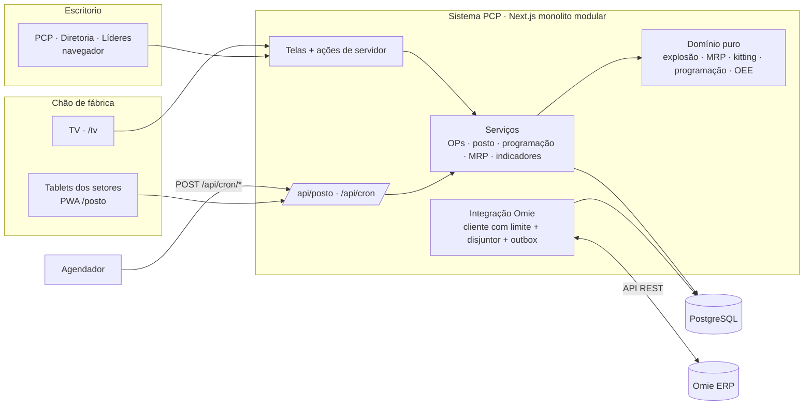
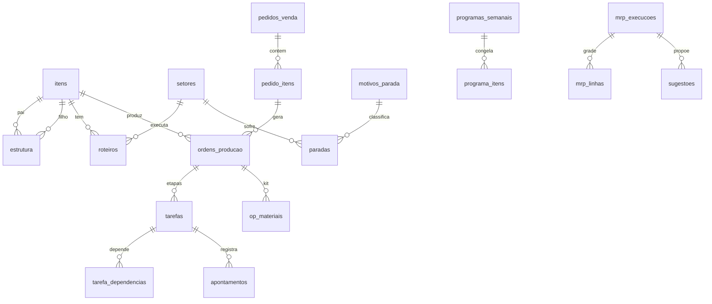

# Arquitetura · PCP Moraes

## 1. Contexto

A Moraes fabrica implementos agrícolas sob encomenda (ex.: CA VIBRO 810 em variantes de unidades, espaçamento e enxadas), com peças comuns que se repetem entre máquinas. O ERP é o **Omie**, que tem estrutura de produto e Ordem de Produção simples (sem roteiro, sem apontamento, sem MRP e sem capacidade). O controle de produção era feito em planilha e depois num quadro do Monday (máquina → conjuntos/peças com status de etapa), sem quantidade e sem horas.

Escala real: 1 fábrica, 6 setores, de 10 a 60 usuários, algumas dezenas de OPs abertas. O desenho é para essa realidade.

## 2. Visão de componentes (C4 nível 1 e 2)

## 3. Decisões (ADRs curtos)

**ADR-01 · Monolito modular em Next.js + PostgreSQL.** Contexto: um time pequeno (ESTG + IA) mantém; uma fábrica. Decisão: um único sistema, com módulos separados por pasta (domínio puro, serviços, integrações, telas). Consequência: deploy simples e barato; se um dia houver várias fábricas, o ponto de evolução é incluir `empresa_id` nas tabelas (multi-tenant), não quebrar em microsserviços.

**ADR-02 · Omie é o dono de produto, estrutura, estoque, pedidos e compras.** O PCP lê esses dados e só escreve no Omie o que mexe em estoque/dinheiro: inclusão e conclusão da OP e requisição de compra. Consequência: uma estrutura só (sem divergência), fiscal e custo continuam no Omie. O PCP acrescenta o que o Omie não tem: roteiro, tempos, política, lotes e lead time.

**ADR-03 · Produção mista no formato Moraes.** Máquina final = sob pedido (OP por pedido). Conjuntos e peças sob pedido são fabricados **dentro** da OP (viram etapas). Peças comuns = **supermercado** com Kanban de reposição (mín/máx), com OP própria de reposição. A montagem puxa do supermercado; o MRP só planeja o que é específico do pedido e as compras.

**ADR-04 · Programação com capacidade finita por raias.** Cada recurso do setor é uma raia; etapas entram por: em andamento → OP liberada → posição fixada pelo líder → prioridade → data prometida → profundidade na estrutura. Uma segunda visão, para trás e com capacidade infinita, mostra a **carga necessária** por semana para cumprir as promessas. Consequência: aproximação suficiente para oficina (não é um APS de otimização), explicável para o líder.

**ADR-05 · Integração com a API do Omie protegida.** Limite por método/minuto, 2 chamadas simultâneas, limite diário opcional, disjuntor (3 erros → pausa de 10 min), uma sincronização por vez (trava no banco), escrita via **outbox** idempotente com repetição exponencial. Métodos de escrita não verificados ficam bloqueados até validação explícita (`OMIE_CONTRATOS_VALIDADOS`).

**ADR-06 · Tablet tolerante a Wi-Fi ruim.** Cada ação vai para uma fila local com chave de idempotência gerada no tablet e é reenviada até confirmar. O servidor grava a chave na mesma transação da ação: reenvio nunca duplica. Ações recusadas ficam visíveis para o operador ("não registradas").

**ADR-07 · OEE só no gargalo, com base no tempo com trabalho.** Em produção sob encomenda, medir OEE em todas as máquinas gera dado sem decisão. O OEE usa como base o tempo em que o setor tinha trabalho (apontado ou parado por problema); a ociosidade por falta de carga aparece separada, como **utilização**.

**ADR-08 · Diretoria aprova o programa, não cada OP.** A aprovação semanal congela as etapas previstas para a semana (base da aderência). Dentro do programa aprovado o PCP libera sozinho. Isso ataca o padrão observado de aprovações centralizadas travando a produção.

## 4. Modelo de dados (principal)

Tabelas de apoio: `estoque_saldos` e `recebimentos_programados` (espelho do Omie), `indisponibilidades` e `calendario_excecoes` (capacidade), `outbox`, `integracao_estado`, `integracao_log`, `acoes_idempotentes`, `auditoria`, `usuarios`, `sessoes`, `tentativas_login`.

## 5. Regras de negócio

**Ciclo da OP:** sugerida → firmada → liberada → em processo → concluída (ou cancelada).
- Firmar/criar: explode a estrutura; gera etapas (item × operação do roteiro) e o kit (comprados + supermercado).
- Liberar: exige kit completo ou falta assumida (quem e por quê). Exige roteiro no item final. Envia a OP ao Omie.
- Concluir: automático quando a última etapa termina. Quantidade boa = menor quantidade boa das operações do item final. Envia a conclusão ao Omie (movimentação de estoque).

**Kitting:** disponível = saldo do Omie − materiais das OPs liberadas e não concluídas (o Omie só baixa na conclusão). Liberações são serializadas para duas OPs não "verem" o mesmo saldo como livre.

**MRP (baldes semanais, 12 semanas):**
- Demanda independente: pedidos de venda em aberto na semana de entrega.
- OP aberta: recebimento programado do item na data prometida; materiais da OP contam integralmente até a conclusão (regra do Omie).
- Conjuntos/peças sob pedido: fantasmas (repassam a necessidade aos filhos).
- Supermercado: se o projetado cair abaixo do mínimo, repõe até o máximo.
- Demais: estoque de segurança; lote mínimo e múltiplo; liberação = necessidade − lead time (arredondado para semanas). Liberação no passado vira "já!".

**Programação:** ver ADR-04. Etapas em andamento consideram o tempo que falta (mínimo de 10% do previsto). Indisponibilidade tira recursos do setor nas datas informadas.

**Indicadores:**
- OTD: OPs de pedido concluídas até a data prometida / concluídas (30 dias).
- Aderência: etapas do programa aprovado da semana anterior concluídas dentro da semana.
- Lead time: liberação → conclusão.
- OEE = disponibilidade × performance × qualidade (ADR-07); performance acima de 100% sinaliza tempo padrão folgado.

## 6. Limites conhecidos e próximos passos

- **Validar no portal do Omie** os métodos marcados "validar" (lista na tela Integrações) antes de ativar a escrita.
- Configurador de variantes por regra (nº de linhas → unidades/enxadas): fase 2, se o número de variantes crescer.
- Previsão de demanda e S&OP (planejamento agregado): fase 2.
- Inventário cíclico com acuracidade por item/contador (as planilhas de inventário mostram acuracidade entre 79% e 86%): recomendado **antes** de confiar no MRP.
- Multiempresa (se a ESTG quiser levar o sistema a outros clientes): incluir `empresa_id` e isolamento por linha.
